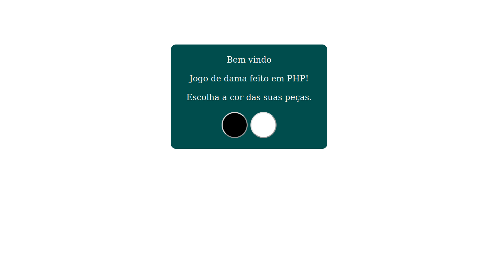
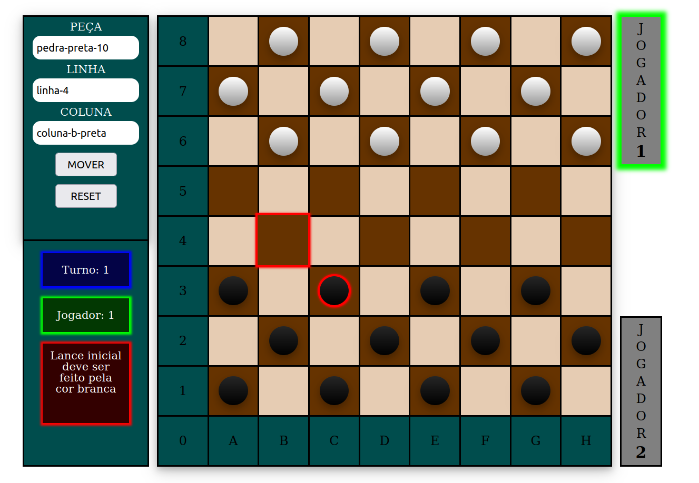

# Dama em PHP

> Status do Projeto: 🚧  Dama em PHP 🚀 Em construção...  🚧

Para o desenvolvimento desse jogo de dama, foi optado por utilizar as regras de damas brasileiras.

### Screenshot da home page

### Screenshot da main page

### 📋 Pré-requisitos

Versão do PHP utilizada para o desenvolvimento desse jogo = PHP 7.4.3

### Funcionalidades desenvolvidas e não desenvolvidas

- [x] Definição das peças
- [x] Definição do tabuleiro
- [x] Definição do controle
- [x] Possibilidade de escolher com qual peça jogar
- [x] Botão de resete para recomeçar o jogo (volta para a opção de escolher com qual peça jogar)
- [x] Selecionar colunas e peças de forma interativa destacando-as clicando com o botão esquerdo do mouse, ao mesmo tempo que preenche as entradas do formulário
- [x] Gerar mensagem de erro se ocorrer um movimento inválido
- [x] Exibir na tela turno e jogador atual
- [ ] Confirmar o movimento da peça clicando com o botão direito do mouse
- [ ] Opção para um jogador
- [ ] Opção para dois jogadores
- [ ] Opção para jogar online
- [ ] Opção para desistir
- [ ] Opção para sugerir empate
- [ ] Ensinar o computador a jogar
- [ ] Histórico de movimentos
- [ ] Opção entrar como visitante com um codinome
- [ ] Opção entrar com credênciais
- [ ] Ranking dos melhores jogadores
- [ ] Opção de jogar contra o criador

### Funcionalidades referentes as regras do jogo

- [x] Não é permitido mover-se para as casas brancas
- [x] Cada jogador só pode mover suas peças no seu turno e somente uma vez a cada turno
- [x] O lance inicial cabe sempre a quem estiver com as peças brancas
- [ ] A pedra move-se só para frente
- [ ] Captura de peças
- [ ] A pedra e a dama podem capturar tanto para frente como para trás
- [ ] Duas ou mais peças juntas, na mesma diagonal, não podem ser capturadas
- [ ] Quando a pedra atinge a oitava linha do tabuleiro ela é promovida à dama
- [ ] A dama anda para frente e para trás, quantas casas quiser
- [ ] A dama não pode saltar uma peça da mesma cor
- [ ] A pedra captura a dama e a dama captura a pedra
- [ ] Se no mesmo lance se apresentar mais de um modo de capturar, é obrigatório executar o lance que capture o maior número de peças
- [ ] A pedra que durante o lance de captura de várias peças, apenas passe por qualquer casa de coroação, sem aí parar, não será promovida à dama
- [ ] Na execução do lance de captura, é permitido passar mais de uma vez pela mesma casa vazia
- [ ] Após 20 lances sucessivos de damas, sem captura ou deslocamento de pedra, a partida é declarada empatada.

### 📄 Licença
Este projeto está sob a licença (GPLv3) - veja o arquivo [LICENSE.md](https://github.com/Ozzy005/Dama-em-PHP/blob/main/README.md) para detalhes.

### ✒️ Autores
* **Rafael Arend** - *Todo o projeto* - [Rafael Arend](https://github.com/Ozzy005)

### 📞 Telefone
* **66 9 9604 0978**

### 📧 Email
* **rafinhaarend123@hotmail.com**

