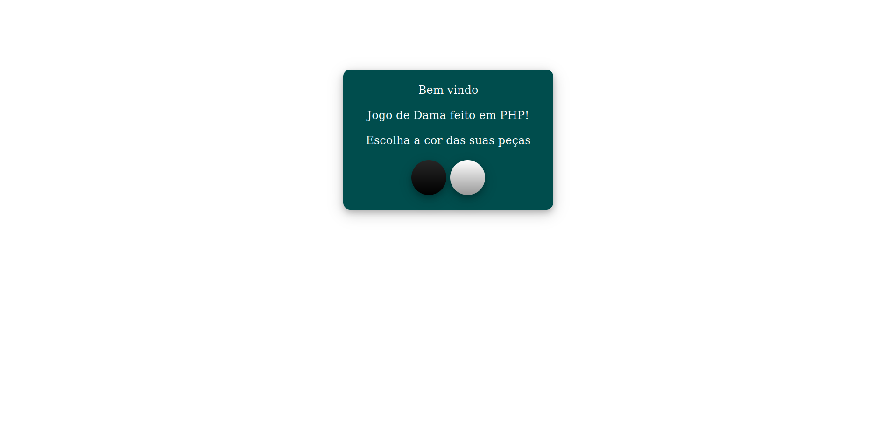
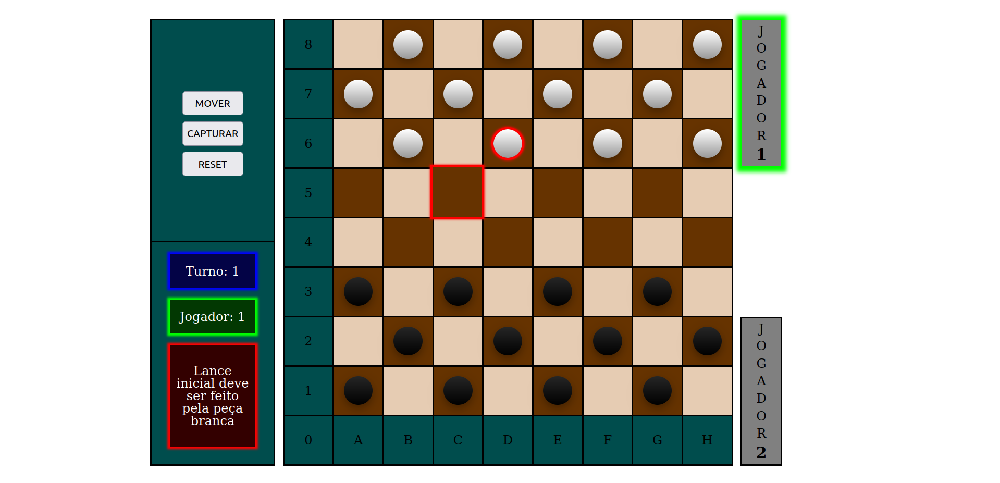

# Dama em PHP

> Status do Projeto: 🚧  Dama em PHP 🚀 Em construção...  🚧

Para o desenvolvimento desse jogo de dama, foi optado por utilizar as regras de damas brasileiras.

### Screenshot da home page

### Screenshot da main page

### 📋 Pré-requisitos

Versão do PHP utilizada para o desenvolvimento desse jogo = PHP 7.4.3

### Funcionalidades

- [x] Definição das peças
- [x] Definição do tabuleiro
- [x] Definição do controle
- [x] Possibilidade de escolher com qual peça jogar (1 = branca, 2 = preta)
- [x] Botão de resete para recomeçar o jogo (volta para a opção de escolher com qual peça jogar)
- [x] Selecionar colunas e peças de forma interativa destacando-as clicando com o botão esquerdo do mouse
- [x] Confirmar o movimento clicando duas vezes com botão esquerdo na casa de destino
- [x] Gerar mensagem de erro se ocorrer um movimento inválido
- [x] Exibir na tela turno e jogador atual
- [ ] Opção para um jogador
- [x] Opção para dois jogadores
- [ ] Opção para jogar online
- [ ] Opção para desistir
- [ ] Opção para sugerir empate
- [ ] Ensinar o computador a jogar (para opção de um jogador)
- [ ] Histórico de movimentos
- [ ] Opção entrar como visitante com um codinome
- [ ] Opção entrar com credênciais
- [ ] Ranking dos melhores jogadores
- [ ] Opção de jogar contra o criador

### Regras

- [ ] O lance inicial cabe sempre a quem estiver com as peças brancas
- [ ] Cada jogador só pode mover suas peças no seu turno e somente uma vez a cada turno
- [x] Proibido a pedra mover-se para trás
- [x] Proibido a pedra mover-se duas casas de uma vez
- [x] Proibido mover-se para as casas brancas
- [x] Proibido mover-se para uma casa ocupada
- [x] Captura de peça única
- [x] Captura de peças múltiplas
- [x] Permitido a pedra capturar tanto para frente quanto para trás
- [x] Proibido capturar uma peça da mesma cor
- [x] Duas ou mais peças juntas, na mesma diagonal, não podem ser capturadas
- [ ] Se em um lance se apresentar uma possibilidade de captura, é obrigátorio executar a captura
- [x] Se no mesmo lance se apresentar mais de uma possibilidade de captura, é obrigatório executar o lance que capture o maior número possível de peças
- [ ] Quando a pedra atinge a oitava linha do tabuleiro ela é promovida à dama
- [ ] A dama move-se para frente e para trás, quantas casas quiser
- [ ] A dama não pode saltar uma peça da mesma cor
- [ ] Permitido a dama capturar tanto para frente quanto para trás
- [ ] A pedra captura a dama e a dama captura a pedra
- [ ] A pedra que durante o lance de captura de várias peças, apenas passe por qualquer casa de coroação, sem aí parar, não será promovida à dama
- [x] Na execução do lance de captura, é permitido passar mais de uma vez pela mesma casa vazia
- [ ] Após 20 lances sucessivos de damas, sem captura ou deslocamento de pedra, a partida é declarada empatada.

### 📄 Licença
Este projeto está sob a licença (GPLv3) - veja o arquivo [LICENSE.md](https://github.com/Ozzy005/Dama-em-PHP/blob/main/README.md) para detalhes.

### ✒️ Autores
* **Rafael Arend** - *Todo o projeto* - [Rafael Arend](https://github.com/Ozzy005)

### 📞 Telefone
* **66 9 9604 0978**

### 📧 Email
* **rafinhaarend123@hotmail.com**

