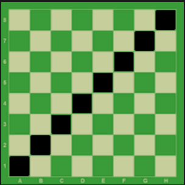
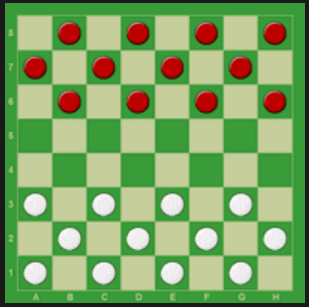
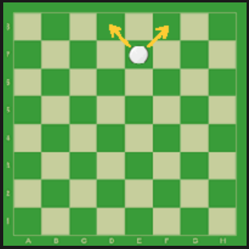
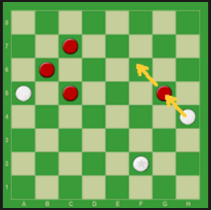
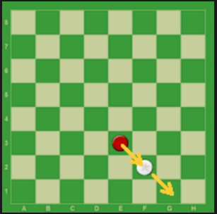
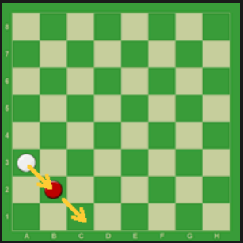
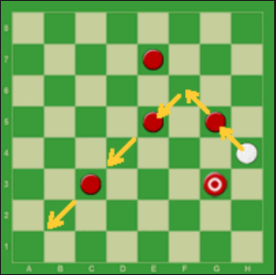
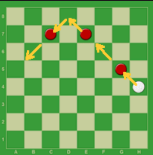
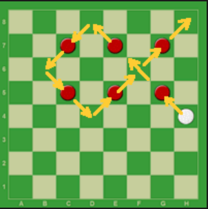
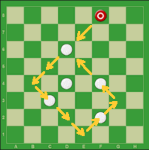

# Dama em PHP

> Status do Projeto: Em desenvolvimento :warning:

---
O jogo de damas é praticado em um tabuleiro de 64 casas, claras e escuras. A grande diagonal (escura), deve ficar sempre à esquerda de cada jogador. O objetivo do jogo é imobilizar ou capturar todas as peças do adversário.

---
O jogo de damas é praticado entre dois parceiros, com 12 pedras brancas de um lado e com 12 pedras pretas de outro lado.
O lance inicial cabe sempre a quem estiver com as peças brancas.

A pedra anda só para frente, uma casa de cada vez. Quando a pedra atinge a oitava linha do tabuleiro ela é promovida à dama.

A dama é uma peça de movimentos mais amplos. Ela anda para frente e para trás, quantas casas quiser. A dama não pode saltar uma peça da mesma cor.

A captura é obrigatória.
Não existe sopro.
Duas ou mais peças juntas, na mesma diagonal, não podem ser capturadas.

A pedra captura a dama e a dama captura a pedra. Pedra e dama têm o mesmo valor para capturarem ou serem capturadas.

A pedra e a dama podem capturar tanto para frente como para trás, uma ou mais peças

Se no mesmo lance se apresentar mais de um modo de capturar, é obrigatório executar o lance que capture o maior número de peças (Lei da Maioria).

A pedra que durante o lance de captura de várias peças, apenas passe por qualquer casa de coroação, sem aí parar, não será promovida à dama.

Na execução do do lance de captura, é permitido passar mais de uma vez pela mesma casa vazia, não é permitido capturar duas vezes a mesma peça.

Na execução do lance de captura, não é permitido capturar a mesma peça mais de uma vez e as peças capturadas não podem ser retiradas do tabuleiro antes de completar o lance de captura.

Empate:
Após 20 lances sucessivos de damas, sem captura ou deslocamento de peça, a partida é declarada empatada.
Finais de:

### 📋 Pré-requisitos

Versão do PHP utilizada para o desenvolvimento desse jogo = PHP 7.4.3

### Funcionalidades desenvolvidas e não desenvolvidas

- [x] Definição das peças
- [x] Definição do tabuleiro
- [x] Possibilidade de escolher a cor das peças que ira jogar
- [x] Definição do controle
- [x] Botão de resete para recomeçar o jogo (volta para a opção de escolher a cor das peças)
- [x] Selecionar casas e peças de forma interativa destacando-as clicando com o botão esquerdo do mouse, ao mesmo tempo que preenche as entradas do formulário
- [x] Gerar mensagem de erro se ocorrer um movimento inválido
- [ ] Confirmar o movimento da peça clicando com o botão direito do mouse
- [ ] Opção para dois jogadores
- [ ] Opção para desistir
- [ ] Opção sugerir empate
- [ ] Histórico de movimentos
- [ ] Opção entrar como visitante com um codinome
- [ ] Opção entrar com credênciais
- [ ] Opção de jogar online
- [ ] Opção de jogar contra o computador
- [ ] Ensinar o computador a jogar
- [ ] Ranking dos melhores jogadores
- [ ] Opção de jogar contra o criador

### Funcionalidades referentes as regras do jogo

- [x] Não é permitido mover-se pelas casas brancas
- [ ] Cada jogador só pode mover suas peças no seu turno e somente uma vez a cada turno
- [ ] O lance inicial cabe sempre a quem estiver com as peças brancas
- [ ] A pedra move-se só para frente, uma casa de cada vez
- [ ] Captura de peças
- [ ] A pedra e a dama podem capturar tanto para frente como para trás
- [ ] Duas ou mais peças juntas, na mesma diagonal, não podem ser capturadas
- [ ] Quando a pedra atinge a oitava linha do tabuleiro ela é promovida à dama
- [ ] A dama anda para frente e para trás, quantas casas quiser
- [ ] A dama não pode saltar uma peça da mesma cor
- [ ] A pedra captura a dama e a dama captura a pedra
- [ ] Se no mesmo lance se apresentar mais de um modo de capturar, é obrigatório executar o lance que capture o maior número de peças
- [ ] A pedra que durante o lance de captura de várias peças, apenas passe por qualquer casa de coroação, sem aí parar, não será promovida à dama
- [ ] Na execução do lance de captura, é permitido passar mais de uma vez pela mesma casa vazia
- [ ] Após 20 lances sucessivos de damas, sem captura ou deslocamento de pedra, a partida é declarada empatada.

## ✒️ Autores

* **Rafael Arend** - *Todo o projeto* - [Rafael Arend](https://github.com/Ozzy005)

## 📄 Licença

Este projeto está sob a licença (GPLv3) - veja o arquivo [LICENSE.md](https://github.com/Ozzy005/Dama-em-PHP/blob/main/README.md) para detalhes.

---
⌨️ com ❤️ por [Rafael Arend](https://github.com/Ozzy005) 😊