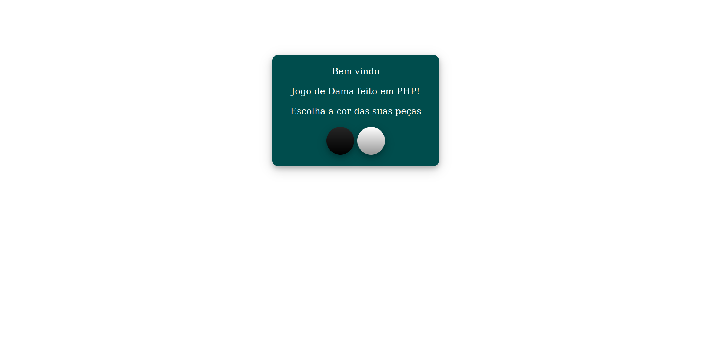
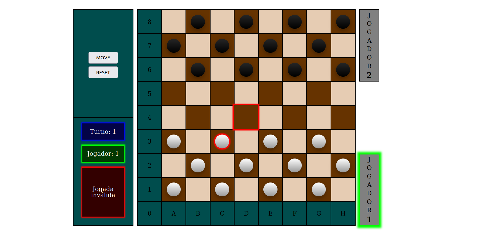

# Dama em PHP

> Status do Projeto: 🚧  Dama em PHP 🚀 Em construção...  🚧

Para o desenvolvimento desse jogo de dama, foi optado por utilizar as regras de damas brasileiras.

### Screenshot da home page

### Screenshot da main page

### 📋 Pré-requisitos

Versão do PHP utilizada para o desenvolvimento desse jogo = PHP 7.4.3

### Funcionalidades
- [x] Definição do tabuleiro.
- [x] Definição das peças.
- [x] Definição do controle.
- [x] Possibilidade de escolher com qual peça jogar (1 = branca, 2 = preta).
- [x] Botão para recomeçar o jogo (volta para a opção de escolher com qual peça jogar).
- [x] Selecionar colunas e peças de forma interativa destacando-as clicando com o botão esquerdo do mouse.
- [x] Confirmar o movimento clicando duas vezes com botão esquerdo na casa de destino.
- [x] Gerar mensagem de erro se ocorrer um movimento inválido.
- [x] Exibir na tela turno e jogador atual.
- [] Função para um jogador (CONTRA O COMPUTADOR).
- [x] Função para dois jogadores (FISICAMENTE).
- [] Função para dois jogadores (ONLINE).
- [] Função desistir.
- [] Função sugerir empate.
- [] Histórico de movimentos.
- [] Função entrar como visitante com um codinome.
- [] Função para se cadastrar e entrar com uma conta.
- [] Ranking dos melhores jogadores.

### RESUMO DAS REGRAS
- [x] 1. Objetivo: imobilizar ou capturar todas as peças do adversário.
- [x] 2. O Jogo de Damas é praticado em um tabuleiro de 64 casas ou de 100 casas, claras e escuras. 
- [x] 3. A grande diagonal (escura), deve ficar sempre à esquerda de cada jogador. 
- [x] 4. O lance inicial cabe sempre ao jogador que estiver com as peças claras. 
- [x] 5. A pedra anda só para frente, uma casa de cada vez. 
- [] 6. Quando a pedra atinge a última linha do tabuleiro, concluindo o lance na casas de coroação, ela é promovida à Dama. 
- [] 7. A Dama é uma peça de movimentos mais amplos. 
- [] 8. A Dama anda para frente e para trás, quantas casas quiser. 
- [x] 9. A captura é obrigatória. Não existe sopro. Duas ou mais peças juntas, na mesma diagonal não podem ser capturadas. 
- [] 10. A pedra captura a Dama e a Dama captura a pedra. Pedra e Dama têm o mesmo valor para capturarem ou serem 
capturadas. 
- [x] 11. A pedra pode capturar, tanto para frente, como para trás, uma ou mais peças. 
- [] 12. A Dama pode capturar, tanto para frente, como para trás, uma ou mais peças. 
- [x] 13. Se no mesmo lance se apresentar mais de uma possibilidade de capturar peças, é obrigatório executar o lance que 
capture o maior número de peças (Lei da Maioria). 
- [x] 14.  A  pedra  que  durante  o  lance  de  captura  de  várias  peças,  apenas  passe  por  qualquer  casa  de  coroação,  sem  aí 
parar, não será promovida a Dama.
- [x] 15. Na execução do lance de captura, é permitido passar mais de uma vez pela mesma casa vazia. 
- [x] 16. Na execução do lance de captura, não é permitido capturar a mesma peça mais de uma vez e as peças capturadas 
não podem ser retiradas do tabuleiro antes de completar o lance de captura. 
- [] 17. A dama no último movimento de captura pode parar em qualquer casa livre na diagonal em que está capturando. A 
dama não é obrigada a parar na casa seguinte após a última peça capturada. 
- [] 18. Empate – 64 casas - Após 20 (vinte) lances sucessivos de Damas de cada jogador, sem captura ou deslocamento 
de  pedra,  a  partida  é  declarada  empatada.
- [] 19. Finais de: 2 damas contra 2 damas; 2 damas contra uma; 2 damas contra uma dama e uma pedra; uma dama contra 
uma dama e uma dama contra uma dama e uma pedra, são declarados empatados após 5 lances de cada jogador. 

### 📄 Licença
Este projeto está sob a licença (GPLv3) - veja o arquivo - [LICENSE.md](https://github.com/Ozzy005/Dama-em-PHP/blob/main/README.md) para detalhes.

### ✒️ Autores
* **Rafael Arend** - *Todo o projeto* - - [Rafael Arend](https://github.com/Ozzy005)

### 📞 Telefone
* **66 9 9604 0978**

### 📧 Email
* **rafinhaarend123@hotmail.com**

